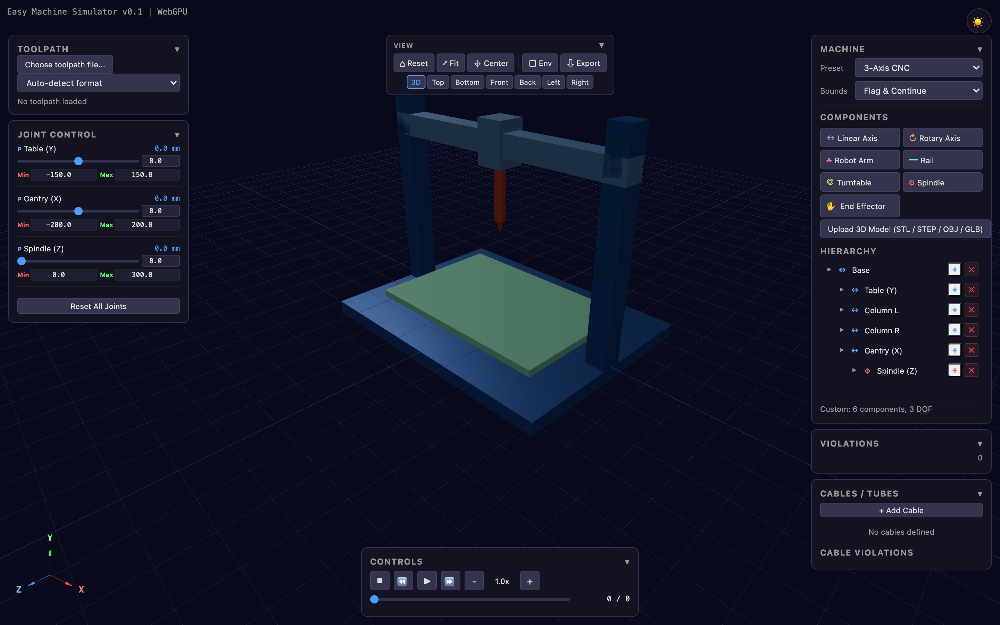

# Easy Machine Simulator

Browser-based 3D simulator for CNC machines and robotic arms — verify work envelopes, toolpaths, and cable routing without installing anything.



## Features

- **3 machine presets** — 3-axis CNC, 5-axis CNC, 6-axis robot
- **Custom machine builder** — drag-and-drop component tree with live kinematics
- **Toolpath verification** — G-code, CSV point lists, JSON CAD lines
- **Work envelope overlay** — real-time bounds & joint limit checking
- **Cable / tube routing** — bend radius & twist validation with 3D drag handles
- **Stiffness enforcement** — joints auto-stop before cable over-bend
- **Playback controls** — play, step, seek, adjustable speed
- **Report export** — JSON & printable HTML
- **Dark / Light theme** — toggle with persistence

See [PRD.md](PRD.md) for the full feature specification.

## Prerequisites

- [Docker](https://www.docker.com/) (Docker Compose V2)

> All builds happen inside Docker — no local Node.js, Rust, or wasm-pack install needed.

## Quick Start

```bash
# Clone
git clone https://github.com/kangzzy/easy-machine-simulator.git
cd easy-machine-simulator

# Start dev server (builds WASM + installs deps + Vite hot-reload)
docker compose up dev --build

# Open in browser
open http://localhost:5173
```

### Other Commands

```bash
# Production build (nginx on port 8080)
docker compose --profile prod up prod --build

# Stop all containers
docker compose down

# Rebuild from scratch
docker compose build --no-cache dev
```

## Tech Stack

| Layer | Technology |
|---|---|
| Rendering | Three.js (WebGPU / WebGL2) |
| Computation | Rust → WASM via wasm-pack (Web Workers) |
| Frontend | TypeScript, Vite |
| Build | Docker multi-stage |

## Project Structure

```
src/
  main.ts                 # Entry point
  renderer/               # SceneManager, ToolpathVisualizer, EnvelopeOverlay
  simulation/             # SimulationEngine (central coordinator)
  machine/                # MachineBuilder, CableRouter, presets
  ui/                     # Panels (Machine, Joint, Cable, Toolpath, Controls)
  workers/                # WASM worker pool
  types/                  # Shared TypeScript interfaces
rust/
  crates/
    ems-core/             # Shared types, nalgebra math
    ems-gcode/            # G-code parser
    ems-kinematics/       # DH parameter kinematic chain
    ems-collision/        # Bounds & joint limit checking
    ems-wasm/             # wasm-bindgen entry crate
```

## Documentation

- [PRD.md](PRD.md) — Full product requirements
- [IMPLEMENTATION.md](IMPLEMENTATION.md) — Architecture & implementation details
- [CLAUDE.md](CLAUDE.md) — Development guidelines for Claude Code

## License

MIT
